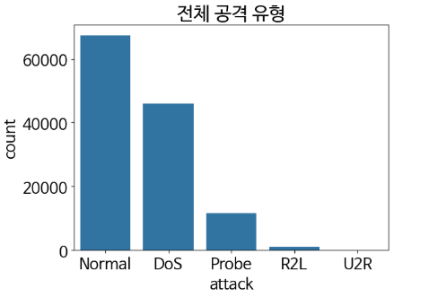
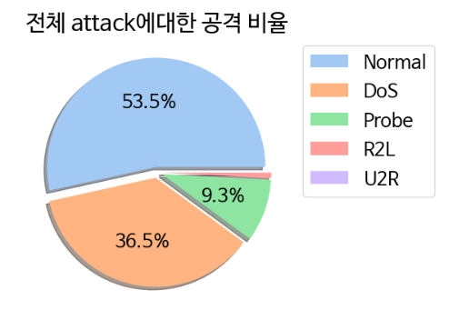
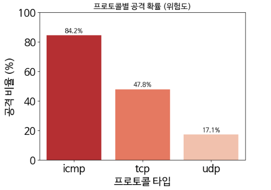

# 🛡️ Network Intrusion Detection System (NSL-KDD)
> **NSL-KDD 데이터셋과 머신러닝(Random Forest)을 활용한 네트워크 5대 공격 유형 탐지 및 분석 프로젝트**

## 📌 1. 프로젝트 개요 (Overview)
본 프로젝트는 **NSL-KDD 데이터셋**을 분석하여 네트워크 트래픽의 5대 공격 유형(Normal, DoS, Probe, R2L, U2R)을 식별하는 머신러닝 모델을 구축하는 것을 목표로 합니다.
단순한 분류 모델링을 넘어, 철저한 데이터 시각화(EDA)를 통해 공격의 물리적 특성(패킷 크기, 접속 빈도 등)을 규명하고, 이를 모델의 변수 중요도(Feature Importance)와 연결하여 설명 가능한 AI관점의 분석을 수행했습니다.

---

## 📊 2. 데이터 분석 및 시각화 (Key Findings)

데이터 분석을 통해 각 공격 유형을 구분 짓는 결정적인 행동 패턴(Signature)을 발견했습니다.
###  전체 공격 유형
- **분석:** NSL-KDD 데이터 셋의 **전체 공격 유형**그래프
- **인사이트:** 전체 공격 유형은 **Normal > Dos > Probe > R2L > U2R** 순

  
   

###  프로토콜 별 공격 유형
- **분석:** 프로토콜 별  **공격확률**그래프
- **인사이트:** 전체 공격 유형은 **icmp가 가장 높은것으로 나타남** icmp, tcp에 대한 주의 필요 상대적으로 udp는 안전

###  물량 공세의 증거: DoS와 `count`
- **분석:** 2초 내 동일 호스트 접속 시도 횟수(`count`)와 공격 확률의 상관관계 분석.
- **인사이트:** 접속 시도가 **100회를 초과하는 순간 공격 확률이 100%에 도달**함. 이는 사람이 아닌 자동화된 봇(Bot)에 의한 물량 공세임을 증명.

###  빈 껍데기 패킷: DoS/Probe와 `src_bytes`
- **분석:** 공격 유형별 전송 데이터 크기(`src_bytes`) 분포 비교 (Log Scale).
- **인사이트:** Normal 트래픽은 데이터 크기가 크고 다양한 반면, **DoS 및 정찰 공격은 0바이트에 가까운 빈 패킷**을 전송함.

###  정찰 행위의 패턴: Probe와 `srv_rate`
- **분석:** 서비스 접근 패턴 산점도 (`same_srv_rate` vs `diff_srv_rate`).
- **인사이트:** 정상 사용자는 특정 서비스를 지속 이용(집중)하지만, **Probe 공격자는 다수의 포트를 무작위로 탐색(분산)**하는 패턴이 뚜렷하게 분리됨.

###  공격 유형과 타겟 서비스
- **분석:** 공격 유형별 공격 서비스
- **인사이트:** Dos는 private나 ecr_i핑 서비스 집중, R2L은 파일 전송 서비스, U2R은 TELNET서비스 집중

---

## 🛠️ 3. 데이터 전처리 (Preprocessing)
머신러닝 성능을 극대화하기 위해 다음과 같은 전처리 과정을 거쳤습니다.

1.  **Attack Mapping:** 23개의 세부 공격 유형을 5대 카테고리(Normal, DoS, Probe, R2L, U2R)로 재분류.
2.  **Label Encoding:** `protocol_type`, `service`, `flag` 등 범주형 변수를 수치형으로 변환.
3.  **Min-Max Scaling:** 값의 범위가 큰 4개 변수(`src_bytes`, `dst_bytes`, `count`, `dst_host_srv_count`)에 대해 0~1 사이로 정규화 수행하여 모델 안정성 확보.

---

## 🤖 4. 머신러닝 모델링 (Modeling)
- **사용 모델:** **Random Forest Classifier**
- **선정 이유:**
    - 의사결정나무의 앙상블을 통한 **과적합(Overfitting) 방지**.
    - 네트워크 공격의 복잡한 비선형적 규칙(Rule) 학습에 탁월.
    - 변수 중요도 추출을 통한 결과 해석 용이.
- **학습 설정:** `n_estimators=100`, `stratify` 옵션을 사용하여 데이터 불균형 문제 완화.

---

## 🏆 5. 결과 및 결론 (Results & Conclusion)

### 성능 평가
- **최종 정확도 (Accuracy):0.9986**
- **변수 중요도 (Feature Importance):**
    - 모델은 **`src_bytes`**, **`count`**, **`diff_srv_rate`**를 최상위 중요 변수로 선정함.
    

### 최종 결론
본 프로젝트는 머신러닝이 네트워크 보안에 있어 **'보이지 않는 패턴'을 찾아내는 강력한 도구**임을 입증했습니다. 특히 TCP와 같이 정상과 공격이 혼재된 복잡한 트래픽 영역에서, 본 모델은 기존의 단순 규칙 기반탐지를 보완하는 효과적인 솔루션이 될 것입니다.

---

## 💻 6. 실행 환경 (Tech Stack)
- **Language:** Python 3.9
- **Libraries:** Pandas, NumPy, Matplotlib, Seaborn, Scikit-learn
